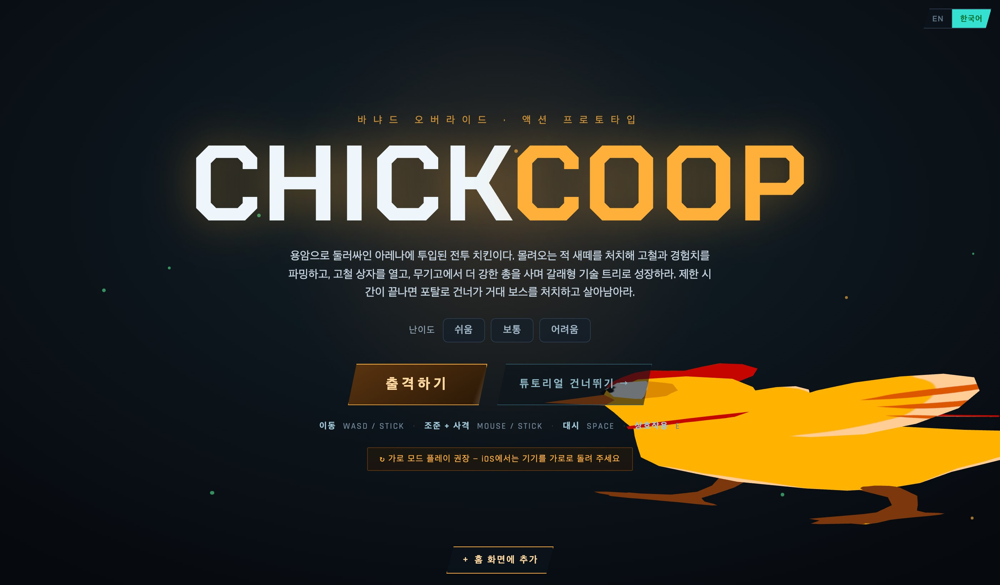
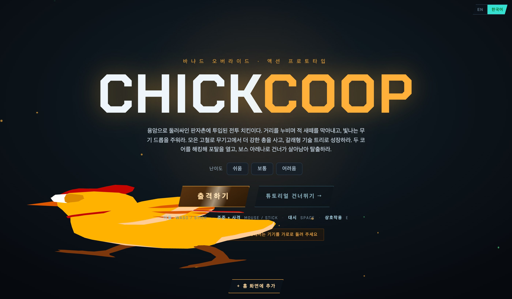
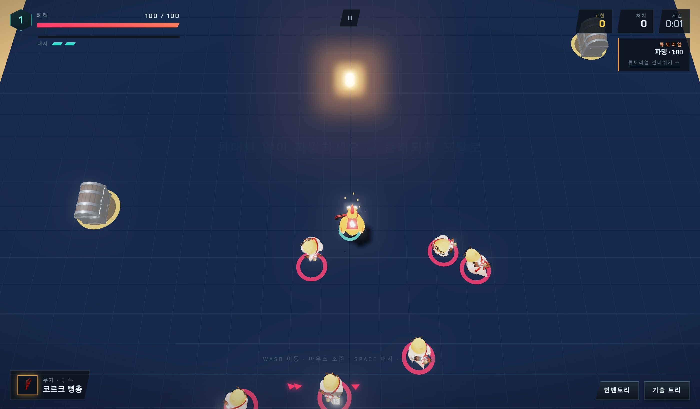
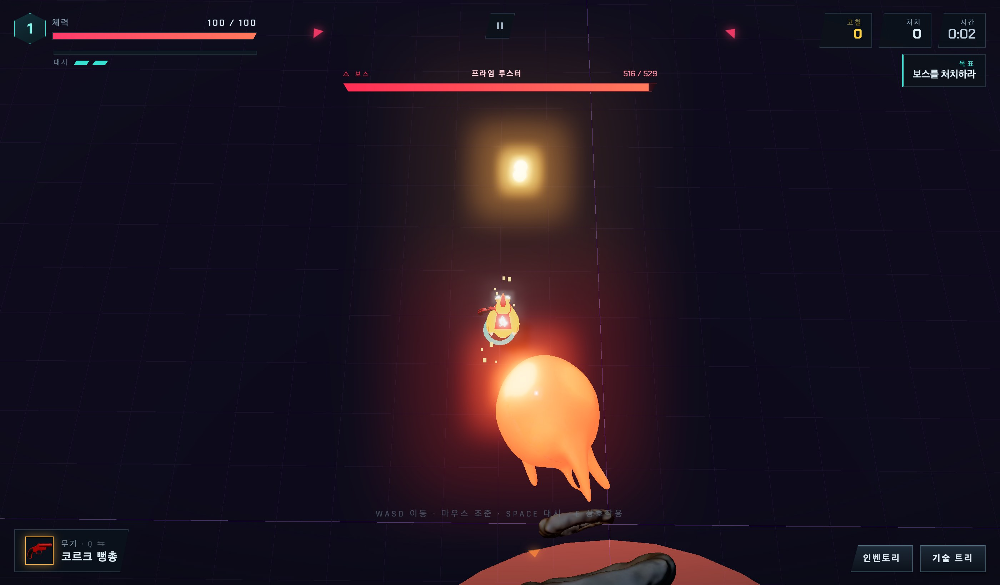

# CHICKCOOP — Barnyard Override

A top-down twin-stick action-roguelite prototype. You're a battle-chicken dropped into
a lava-ringed arena: **farm** the swarm for scrap and XP, buy bigger guns, grow a branching
tech tree, then take the portal to a **giant boss**. Runs in the browser (Three.js), plays on
desktop and mobile (twin-stick touch), and installs as a PWA.

**▶ Play:** deployed to Cloudflare Workers. Pick a difficulty, then Deploy (with tutorial) or
Skip Tutorial.

---

## Screens

### Home
Title screen — difficulty select (Easy / Normal / Hard), Deploy, and Skip Tutorial.



### Tutorial — training bay
A short scripted bay that teaches move / aim-fire / dash / pickup / fight / shop / crate /
upgrade, then a portal to the main map.



### Main map — farm phase
Survive and loot for a 1-minute timer (crates for scrap, kills for XP). Mobs spawn around you
as you push forward. The exit portal is always open — enter the boss any time, or farm the
clock out and then take the portal.



### Boss room
A menacing procedural colosseum. Take down a 5×-scale rooster with telegraphed attacks —
Ground Slam (AoE), Rooster Charge (dash), and Carpet Bomb (a rapid barrage across your area).



---

## Features

- **Twin-stick combat** — desktop (WASD + mouse) or mobile (dual touch sticks); dash i-frames.
- **Difficulty** — Easy / Normal / Hard scale enemy HP and incoming damage.
- **Farm → boss flow** — timed farming phase, always-open portal, then a giant telegraphed boss.
- **Weapons & tech tree** — buy guns in the shop; a branching skill tree (offense / defense /
  mobility / utility) with real modifiers.
- **Readability** — tier-colored enemy ground rings, danger telegraphs, damage numbers.
- **PWA** — installable, auto-updating; Korean / English.

## Tech

- **Three.js** (hand-rolled engine), **Vite** build.
- All maps are **procedural arenas** (no scene GLBs); characters are GLB models.
- Deployed to **Cloudflare Workers** via GitHub Actions on push to `production`.

## Run locally

```bash
npm install
npx vite --port 5299   # dev server
npm run build          # production build
```

## Docs

- `docs/ARCHITECTURE.md` — engine structure, conventions, rendering/perf pitfalls.
- `docs/MAP_GUIDE.md` — map/level authoring + placement procedure.
- `docs/BACKLOG.md` — status / known issues.
- `docs/POSTMORTEM.md`, `docs/NEXT_GAME_GUIDE.md` — honest retrospective + a guide for
  building the next one properly.

> This is a **prototype**. It plays end-to-end but the art is placeholder and the combat
> depth is shallow — see `docs/POSTMORTEM.md` for an honest accounting.
